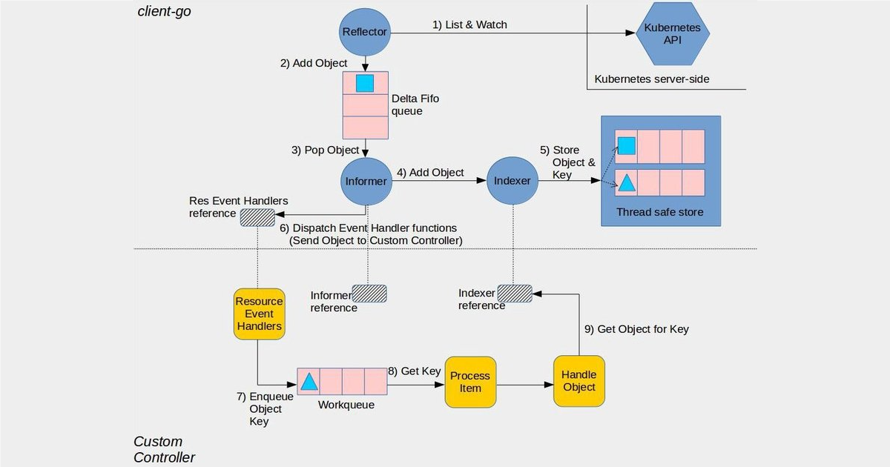

# go-operator  
Lets deep dive on the Operators in Kubernetes.

### Kubernetes Operator
It is a custom controller that extends kubernetes capabilities to manage complex applications and automate thier tasks. Operators are clients of the Kubernetes API that act as controllers for a Custom Resource.

### Operator Working
An Operator adds an endpoint to the kubernets API called a custome resource (CR),  along with a control plane component that monitors and maintain resource of new type.

### Key components of Kubernetes Operator
1. Custom Resource Definitions (CRDs)
2. Custom Resource (CR)
3. Controller
4. Reconciliation Loop
5. Role-Based Access Control (RBAC)
6. Operator Lifecycle Manager (OLM)

### Resource in Kubernetes
A Resource is an endpoint in the Kubernetes API that stores a collection of API objects of a certain kind.

### Custom Resource
A Custom Resource is an object that extends the Kubernetes API or allows you to introduce your own API into a project or a cluster.

### Create the custom resourece Object
Custom resouce objects are created by creating an object from a Custom Resource Definition (CRD).

### CRD
A CRD stands for Custom Resource Definition, its a file that let us define our own object kinds and lets the API Server handle the entire lifecycle.

## Understanding Controller
Major portion of writng an operator is, writing its controller. Basically a controller works as below,
1. Start Controller
2. Watch for changes to Custom Resources (CRs)
3. Enqueue events (create/update/delete)
4. Process the queue:
   a. Fetch the object from the API
   b. Compare current state with the desired state
   c. Take corrective action (reconcile)
5. Repeat
We can understand controller by reffering to the code given by Kubernetes team (`sample-controller`).

### Sample Controller
The [Sample Controller](https://github.com/kubernetes/sample-controller) is a Kubernetes Operator example that demonstrates how to write a custom controller using the Kubernetes client-go library.
### NewController
* Takes Kubernetes clientset, custom resource clientset, shared informer, and workqueue as inputs.
* Initializes and returns a new Controller instance.
```go
func NewController(
	kubeclientset kubernetes.Interface, // Communicates with Kubernetes APIs.
	sampleclientset clientset.Interface, // sampleclientset: Interacts with the custom resource.
	informer informers.SharedInformerFactory, // informer: Watches changes to the custom resource.
	workqueue workqueue.RateLimitingInterface, // workqueue: Ensures event processing is handled efficiently.
) *Controller
```
### RUN
* Starts the controller.
* Waits for informers to sync.
* Spins up multiple worker threads to process events.
```go
func (c *Controller) Run(threadiness int, stopCh <-chan struct{}) error
```
### Control loop
```go
func (c *Controller) runWorker(ctx context.Context) {
  for c.processNextWorkItem(ctx) {
    }
}
```
```go 
func (c *Controller) processNextWorkItem() bool {
  objRef, shutdown := c.workqueue.Get()
  err := c.syncHandler(ctx, objRef)
  utilruntime.HandleErrorWithContext(ctx, err, "Error syncing; requeuing for later retry", "objectReference", objRef)
}
```
* Fetches the next item from the queue.
* Calls the syncHandler function to reconcile.
* Removes the item from the queue after processing.
### Synchandler
```go
func (c *Ctrl) syncHandler(key string) error {}
```
* The core reconciliation logic of the controller.
* Retrieves the object using its key (namespace/name).
* Ensures the object is in the correct state.
### Queue
```go
func (c *Controller) enqueue(obj interface{})
func (c *Controller) handleObject(obj interface{})
```
* enqueue: Adds new items to the queue when a relevant object changes.
* handleObject: Reacts to changes in related objects and enqueues them.
### Informer
An Informer in Kubernetes is a key component of the controller pattern. It is responsible for watching Kubernetes resources (like Pods, Deployments, or Custom Resources) and caching their state locally, reducing direct API calls to the Kubernetes API server.
* List & Watch
* Cache
* Event Notification
* Reconciliation trigger

#### RateLimiter
A Rate Limiter in a Kubernetes controller helps control the number of reconciliation attempts to avoid overwhelming the API server or the managed resources. 

## Custom Controller Architecture


## Repository
Create a github repo and clone the repo.
```sh
git clone https://github.com/ManojChandran/chowki
cd chowki
go mod init github.com/ManojChandran/chowki
go mod tidy
```
## Get started
Run the init command inside of it to initialize a new project, Init command will create basic project structure with all the configurations for a base CRD.
```sh
kubebuilder init --domain  devops.tools --repo devops.tools/controller
```
### config
All our launch configurations under the config/ directory and it contains Kustomize YAML definitions required to launch our controller on a cluster.
* `config/default` contains a Kustomize base for launching the controller in a standard configuration.
* `config/manager` contains a Kustomize base for launching as pods in the cluster.
* `config/rbac`    contains a Kustomize base for required permissions to run your controllers under their own service account

### Makefile
In addition to the configuration, `Makefile` does some heavy lifting for us:
* make (Default Target)
* make run (Run Operator Locally)
* make manifests (Generate CRDs & RBAC)
* make install (Apply CRDs to Cluster)
* make build (Build Operator Binary)
* make docker-build (Build Docker Image)
* make docker-push (Push Image to Registry)
* make deploy (Deploy Operator to Cluster)
* make uninstall (Remove CRDs from Cluster)
* make test (Run Unit Tests)
* make fmt (Format Code)
* make vet (Static Analysis)
* make help (Show Available Commands)

### main.go
Our entry point to the operator is `main.go`
* Core controller-runtime library
* Default controller-runtime logging, Zap (more on that a bit later)
* Manager to track of running all of our controllers
* Scheme, which provides mappings between Kinds and their corresponding Go types.
* Basic health checks

> Go types: GroupVersion(GV),GroupResource(GR), GroupKind(GK), GroupVersionResource(GVR), GroupVersionKind(GVK)
### Kubernetes API
Determine group/version for our API.
* Kind - A schema for an object, mapping to a Go type (Capital Letters). 
* Resource - An HTTP enpoint/Path (Lower case plurals)
* Group -  A set of resources that are exposed together
* Version - Unique versions to a group

> API Endpoint - /apis/apps/v1/namespaces/default/deployemnts/nginx
```sh
kubectl api-resources
kubectl api-versions
kubectl get --raw /apis |jq '.'  # api resources with versions
```
Build API and for our, run below command.
```sh
kubebuilder create api --group crd --version v1 --kind Chowki
```
This will create API and Controller for our operator.

## Set up kind cluster for running kubernetes
Manifest file
```yaml
kind: Cluster
apiVersion: kind.x-k8s.io/v1alpha4
nodes:
  - role: control-plane
  - role: worker
  - role: worker
  - role: worker
```
Cluster creation 
```sh
kind create cluster --name my-cluster --config kind-cluster.yaml
```
Cluster Deletion
```sh
kind delete my-cluster
```
## Testing
To test the controller built using Kubebuilder with this Makefile, follow these steps:

### Run Static Code Checks
Before running the controller, ensure that the code is formatted correctly and free from obvious issues.
```sh
make fmt       # Format the code
make vet       # Run static analysis on the code
make lint      # Run linting checks
```

### 2. Generate Required Code and Manifests
Generate necessary Kubernetes manifests, RBAC rules, CRDs, and DeepCopy functions.
```sh
make manifests  # Generate CRDs, RBAC, and Webhooks
make generate   # Generate DeepCopy methods
```
> Install custom resource 
> kubectl apply -k config/samples/

### 3. Build and Run the Controller Locally
To test the controller on your host machine (without deploying it in Kubernetes):
```sh
make build  # Build the controller binary
make run    # Run the controller locally
```
> **Note:** Running locally requires access to a Kubernetes cluster, usually via `~/.kube/config`.

### 4. Run Unit Tests
Run tests using `envtest`:
```sh
make test  # Run unit tests with envtest
```

### 5. Deploy the Controller in Kubernetes
If you want to test the controller inside a Kubernetes cluster:
```sh
make docker-build  # Build the Docker image
make docker-push   # Push the image to a registry (if required)

# Deploy CRDs
make install  

# Deploy the controller
make deploy
```
> **Note:** Ensure that the Kubernetes cluster is running and accessible.

# ______________
### Shared informers
Shared data cache and it is distributing the data to all the listeners interested in knowing the changes that are happening to data.
```go
porInformer = InformerFactory.Core().V1().Pods()
```
### Shared informer - event handler
```go
podInformer.Informers - event handler(
  cache.ResourceEventHandlerFuncs{
    // react to newly added objects
    AddFunc: func(obj interface{}) {},
    // react to update to the object
    UpdateFunc: func(old, cur interface{}) {},
    // react to object removal
    DeleteFunc: func(obj interface{}) {},
  }
)
```
### Shared informer - listers
```go
podstore = podInformer.Lister()
```
